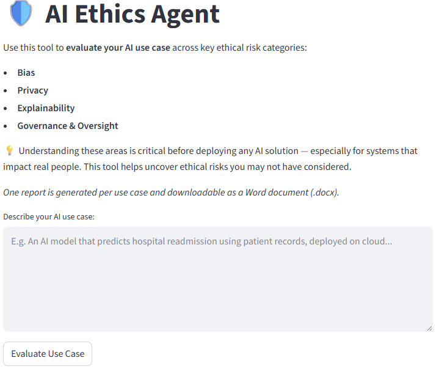

# AI Ethics Agent
👉 **Try the Live App:** [ai-ethics-agent.streamlit.app](https://ai-ethics-agent.streamlit.app)

A simple, practical application that helps **evaluate AI use cases** for ethical risk across four key dimensions:

- **Bias**
- **Privacy**
- **Explainability**
- **Governance & Oversight**

Whether you're a developer, researcher, or project lead, this tool helps uncover potential ethical risks **before deployment** — especially for AI systems that affect real people.

---

## What It Does

1. **You describe an AI use case** (e.g., predicting hospital readmission using patient data).
2. The app analyzes it using OpenAI's `gpt-4o-mini` across 4 ethical categories.
3. It generates a report with:
   - Risk level (Low, Moderate, High)
   - Short explanation for each category
4. You can **view the report**, **copy it**, or **download it as a .docx file**.

---

## 📸 Preview

  


---

## 🧠 Technologies Used

- [Streamlit](https://streamlit.io/)
- [LangChain](https://www.langchain.com/)
- [OpenAI API](https://platform.openai.com/)
- [python-docx](https://pypi.org/project/python-docx/)

---

## ⚙️ Local Setup (Advanced Users)

Clone the repo and run locally:

```bash
# Clone the repo
git clone https://github.com/dandersonghub/AI-Ethics-Agent.git
cd AI-Ethics-Agent

# Install uv if not already installed
pip install uv

# Create virtual environment and install packages
uv venv
uv pip install -r requirements.txt

# Set your OpenAI API key
echo OPENAI_API_KEY="sk-..." > .env

# Run the app
streamlit run streamlit_app.py
```

---

## 📝 Repo Structure

```
AI-Ethics-Agent/
├── agent.py             # Async LangChain agent logic
├── streamlit_app.py     # Main Streamlit frontend
├── prompts.yaml         # Ethical evaluation prompts
├── reports/             # Saved evaluation reports (.md only)
├── requirements.txt     # Runtime dependencies
├── .gitignore           # Excludes .env, .venv, reports, etc.
├── README.md            # You're reading it!
```

---

## 📢 Contributing

Have an idea or suggestion? Open an issue or fork the project!
